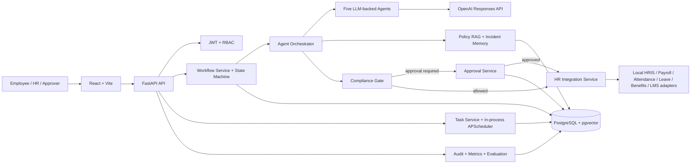

# Agentic HR AI - Governed HR Agent Platform

Agentic HR AI is an interview-scale HR operations platform for employees, HR teams,
approvers, and auditors. It turns HR questions and anomalies into persisted,
auditable workflows that combine LLM reasoning with deterministic policy,
authorization, approval, scheduling, and data-mutation controls. The strongest
implemented scenario is a payroll or attendance correction that may require human
approval before an idempotent adapter action is applied.

> Scope note: workflow and approval behavior is implemented. The HR-system adapters
> use local database records rather than live Darwinbox or payroll-vendor APIs.

## Start Here

### Prerequisites

- Docker Desktop running with Docker Compose enabled
- An OpenAI Platform API key with access to the model configured by `LLM_MODEL`
- Ports `3000`, `8000`, and `5432` available

### Start everything with Docker

Open PowerShell in the repository root:

```powershell
cd C:\path\to\AgenticHRSystem
$env:OPENAI_API_KEY="<your-real-openai-api-key>"
docker compose up --build -d
docker compose ps
```

The first build downloads the PostgreSQL/pgvector, Python, and Node images and may
take several minutes. A successful `docker compose ps` shows all three services as
healthy:

```text
darwinboxai_postgres   healthy   5432
darwinboxai_backend    healthy   8000
darwinboxai_frontend   healthy   3000
```

Open:

- Web UI: [http://localhost:3000](http://localhost:3000)
- Swagger/OpenAPI: [http://localhost:8000/api/docs](http://localhost:8000/api/docs)
- Liveness: [http://localhost:8000/health](http://localhost:8000/health)
- Readiness: [http://localhost:8000/ready](http://localhost:8000/ready)

Expected health responses:

```json
{"status":"ok","service":"DARWINBOXAI"}
```

```json
{"status":"ready","database":"connected"}
```

### Database migration and seed behavior

The backend startup command automatically performs these steps in order:

```text
alembic upgrade head
python -m scripts.seed_db
uvicorn app.main:app
```

The seed operation is idempotent: restarting the stack does not duplicate users or
the fixed demo employees. It creates permissions, roles, demo users, five fictional
employees, and sample payroll records.

Seeded login accounts all use password `demo123!`:

| Username | Role |
|---|---|
| `employee` | `EMPLOYEE` |
| `manager` | `MANAGER` |
| `payroll` | `PAYROLL_SPECIALIST` |
| `compliance` | `COMPLIANCE_OFFICER` |
| `admin` | `HR_ADMIN` |
| `sysadmin` | `SYSTEM_ADMIN` / superuser |

Recommended UI login:

```text
Username: admin
Password: demo123!
```

To run the seed manually inside an already running backend container:

```powershell
docker compose exec backend python -m scripts.seed_db
```

### Use the web UI

1. Sign in at `http://localhost:3000` with `admin` / `demo123!`.
2. Open **Admin -> Employees** to view seeded employee records.
3. Open **Workflows -> New workflow**, enter a request summary and employee database
   ID, then create the workflow.
4. Open the workflow row and click **Run agents**.
5. Follow the persisted state timeline.
6. If the state becomes `WAITING_FOR_APPROVAL`, open **Approvals**, review and
   approve/reject it, return to the workflow, and click **Resume agents**.
7. A successful terminal run ends in `COMPLETED`.
8. Scroll to **Agent outputs -> Agent decisions** to inspect every structured agent
   response. The Action card shows `NO_ACTION` or the proposed mutation; the
   Compliance card shows `ALLOW`, `REQUIRE_APPROVAL`, `DENY`, or `ESCALATE`.
9. Use **Audit trail** to inspect persisted operational events.

A workflow can complete with `NO_ACTION` when the request lacks evidence of an
expected value. For a deterministic insertion, correction, approval, and mutation
demo, use the Postman collection below.

### Run the complete Postman demo

Import:

[`postman/AgenticHRSystem.postman_collection.json`](postman/AgenticHRSystem.postman_collection.json)

No separate Postman environment is required. Run the entire collection in its saved
order. Collection scripts automatically capture tokens, employee ID, policy ID,
workflow ID, and approval ID.

The collection performs:

```text
health/readiness
-> employee and admin login
-> employee insertion
-> policy insertion/search
-> high-risk data-correction workflow
-> five-agent execution
-> HR admin approval
-> approved HRIS mutation
-> employee/timeline/audit/incident verification
```

### Logs, restart, stop, and reset

Follow all logs:

```powershell
docker compose logs -f
```

Backend-only logs:

```powershell
docker compose logs -f backend
```

Restart the existing containers:

```powershell
docker compose up -d
```

Stop containers while preserving database data:

```powershell
docker compose down
```

Delete containers and all local PostgreSQL data, then recreate a clean seeded system:

```powershell
docker compose down -v
$env:OPENAI_API_KEY="<your-real-openai-api-key>"
docker compose up --build -d
```

`docker compose down -v` permanently removes local demo workflows, approvals,
policies, audit events, and inserted employee records.

### Common startup issues

| Symptom | Check |
|---|---|
| Compose says `OPENAI_API_KEY` is required | Set `$env:OPENAI_API_KEY` in the same PowerShell session |
| `/ready` returns `503` | Check `docker compose logs backend` and confirm the API key/database |
| Login says invalid credentials | Use exactly `admin` / `demo123!`; hard-refresh with `Ctrl+Shift+R` |
| UI still shows an older build | Run `docker compose up --build -d` and hard-refresh |
| Workflow becomes `FAILED` | Open its timeline/Agent decisions and check backend logs |
| Ports are already allocated | Stop the other service or change host-side Compose port mappings |

### Which document should I read?

| What you need | Read this file |
|---|---|
| Basic installation and startup | [docs/LOCAL_SETUP.md](docs/LOCAL_SETUP.md) |
| Quick reviewer demo with API calls | [docs/DEMO_GUIDE.md](docs/DEMO_GUIDE.md) |
| Overall system architecture | [docs/HLD.md](docs/HLD.md) |
| Workflow states, agents, approval and resume | [docs/WORKFLOW.md](docs/WORKFLOW.md) |
| Database tables and relationships | [docs/DATA_MODEL.md](docs/DATA_MODEL.md) |
| API endpoints, requests and responses | [docs/API_DESIGN.md](docs/API_DESIGN.md) |
| Authentication, authorization and compliance | [docs/SECURITY_AND_COMPLIANCE.md](docs/SECURITY_AND_COMPLIANCE.md) |
| Architecture decisions and limitations | [docs/TRADE_OFFS.md](docs/TRADE_OFFS.md) |
| Safe sample request payloads | [`examples/`](examples/) |

Recommended reading order for interview review:

1. Read this README.
2. Open [docs/HLD.md](docs/HLD.md) for architecture diagrams.
3. Open [docs/WORKFLOW.md](docs/WORKFLOW.md) for the complete agent and approval flow.
4. Follow [docs/DEMO_GUIDE.md](docs/DEMO_GUIDE.md) to run the demonstration.

## Problem Statement

HR operations mix open-ended interpretation with high-consequence actions. This
system supports employee HR questions, payroll/leave/attendance/benefits/LMS
anomalies, data corrections, scheduled scans, and system-triggered workflows.
Complaints can be submitted as general HR requests, but case-management and
notification delivery are future scope. Sensitive changes are gated by compliance
and, when required, authorized human approval.

## Key Capabilities

- LLM-backed request classification and five-agent orchestration
- Metadata-filtered policy retrieval with traceable citations
- Evidence-based anomaly analysis and controlled action proposals
- Deterministic compliance constraints with `ALLOW`, `REQUIRE_APPROVAL`, `DENY`,
  and `ESCALATE`
- Durable, role-based, multi-level human approval
- Persisted workflow state, transitions, agent outputs, evidence, and retries
- Sanitized episodic incident memory
- Priority-ordered scheduled scans with durable task runs
- Idempotent, allow-listed adapter mutations with dry-run validation
- Hash-linked audit events, structured logs, correlation IDs, metrics, and evaluations

## Architecture Overview



The agentic layer interprets requests and produces structured recommendations.
Deterministic services own authentication, state transitions, persistence,
authorization, approval, scheduling, compliance invariants, and mutations. PostgreSQL
is the system of record; pgvector stores portable 128-dimensional local embeddings.
There is no Redis, message broker, or separate worker process in the current build.

The original architecture image is preserved at
[docs/DarwinBoxHLD.jpg](docs/DarwinBoxHLD.jpg). The Mermaid diagrams in this package
describe the implemented repository and are the maintainable source of truth.

## Repository Structure

```text
backend/
  app/
    agents/          # Five LLM-backed agents and shared structured-output contract
    workflows/       # Explicit workflow transition graph
    services/        # Orchestration, approval, RAG, adapters, tasks, observability
    repositories/    # SQLAlchemy persistence boundaries
    models/          # Relational entities and enums
    api/v1/          # FastAPI routes and Pydantic schemas
    adapters/        # Simulated employee-scoped HR system adapters
    rag/             # Ingestion, local embeddings, retrieval, incident memory
    llm/             # OpenAI Responses API client
    workers/         # In-process APScheduler dispatcher
    audit/            # Hash-linked audit event service
  tests/             # Unit, API integration, and end-to-end coverage
  alembic/           # Database migrations
frontend/
  src/               # React dashboard, workflows, approvals, audit, admin screens
docs/                # Interview architecture and operational documentation
examples/            # Safe fictional request/response payloads
```

## Agent Responsibilities

| Component | Responsibility | Inputs | Outputs | Reasoning mode |
|---|---|---|---|---|
| Supervisor | Classifies intent and requests clarification | Summary and request data | Intent, route, clarification decision | LLM + enum/route validation |
| Anomaly Investigation | Compares observed and expected records | Adapter context and request facts | Finding, discrepancy, confidence, evidence | LLM + deterministic calculations |
| Policy | Grounds the workflow in retrieved policy chunks | Policy matches and metadata | Citations, grounding and conflict flags | LLM + immutable citations |
| Action | Proposes a dry-run-safe correction | Investigation and policy outputs | Action type, payload, idempotency key | LLM + deterministic payload/hash |
| Compliance | Selects the control path | Action, policy, risk, authorization inputs | Allow/approval/deny/escalate decision | LLM explanation + deterministic constraints |
| Orchestrator | Executes agents and persists every step | Workflow ID | Current state and agent outputs | Deterministic service |

Why not make everything an agent? Persistence, authorization, scheduling, approval
state changes, idempotency, and external writes require predictable behavior that can
be tested and reconstructed. Agents advise inside those boundaries; they do not own
the boundaries.

## End-to-End Payroll Workflow

1. An authenticated user creates `POST /api/v1/workflows/`.
2. The workflow is saved as `RECEIVED`.
3. `POST /api/v1/workflows/{workflow_id}/run` authenticates, authorizes, classifies,
   retrieves similar incidents and employee-scoped adapter context, checks freshness,
   investigates the discrepancy, retrieves policy, and proposes an action.
4. Compliance persists its decision.
5. A low-risk allowed action proceeds through dry-run, mutation, verification, and
   `COMPLETED`.
6. A high-risk action creates an approval, transitions to
   `WAITING_FOR_APPROVAL`, and persists `paused_at`.
7. An authorized role approves. The workflow transitions to `APPROVED`.
8. Calling `/run` again resumes from persisted agent outputs, executes the adapter
   action once, verifies it, records sanitized incident memory, and completes.

See [docs/WORKFLOW.md](docs/WORKFLOW.md) for the state and sequence diagrams.

## Compliance vs Approval

Compliance decides whether an action is permissible. Approval records human consent
for a permissible but sensitive action.

- `ALLOW`: execute without approval.
- `REQUIRE_APPROVAL`: create a role-bound approval and pause.
- `DENY`: terminate; it is not sent to an approver.
- `ESCALATE`: terminate this automated path for manual handling.

For example, a read-only/no-change result is allowed directly. A high-risk payroll
correction requires `HR_ADMIN` by default. An explicit policy violation is denied.

## Workflow Persistence and Resume

`Workflow.current_state`, `previous_state`, `version`, pause fields, retry counters,
and timestamps are stored in PostgreSQL. Each transition, agent execution, evidence
item, compliance decision, and approval decision has its own record. Updates use a
workflow version check for optimistic locking.

While awaiting approval, the workflow is both `WAITING_FOR_APPROVAL` and paused.
Approval is accepted only once, only while pending, only before expiry, and only from
the required role, superuser, or active delegate. Duplicate decisions return a
conflict-style validation error instead of executing twice. Approval advances the
workflow to `APPROVED`; a subsequent run reconstructs prior agent outputs and
continues at execution. Adapter writes use a persisted idempotency key. Failed
workflows can move through `RETRY_SCHEDULED` back to `RECEIVED` within `max_retries`.

## API Overview

All `/api/v1` business routes require bearer authentication unless noted.

| Method | Path | Purpose | Main input | Main output |
|---|---|---|---|---|
| POST | `/api/v1/auth/login` | Issue JWT tokens | username, password | user and tokens |
| POST | `/api/v1/workflows/` | Create HR workflow | trigger, employee, summary, data | workflow ID and state |
| POST | `/api/v1/workflows/{id}/run` | Run/resume agents | path ID | state, agent outputs, approval |
| GET | `/api/v1/workflows/{id}` | Read persisted workflow | path ID | state, transitions, evidence count |
| GET | `/api/v1/workflows/{id}/timeline` | Read transition/evidence timeline | path ID | transitions and evidence |
| POST | `/api/v1/workflows/{id}/pause` | Pause non-terminal workflow | reason | pause state |
| POST | `/api/v1/workflows/{id}/retry` | Retry failed workflow | path ID | retry count and state |
| GET | `/api/v1/approvals/` | List visible approvals | status, pagination | approval page |
| POST | `/api/v1/approvals/{id}/approve` | Approve current level | comments | approval status/history |
| POST | `/api/v1/approvals/{id}/reject` | Reject and terminate workflow | comments | rejected approval |
| POST | `/api/v1/rag/policies` | Ingest policy text | metadata and content | policy metadata |
| GET | `/api/v1/rag/policies/search` | Search policy chunks | query and filters | scored citations |
| POST | `/api/v1/tasks/` | Create scheduled/manual task | cron, scope, priority, workflow type | task |
| POST | `/api/v1/tasks/{id}/run` | Trigger task now | path ID | durable run |
| GET | `/api/v1/audit/` | Query audit events | filters, pagination | events |
| GET | `/api/v1/metrics` | Database/runtime metrics | — | workflow/agent/task metrics |
| GET | `/health` | Liveness | — | service status |
| GET | `/ready` | Database and LLM configuration readiness | — | ready or 503 |

Example:

```bash
curl -X POST http://localhost:8000/api/v1/workflows/ \
  -H "Authorization: Bearer $ACCESS_TOKEN" \
  -H "Content-Type: application/json" \
  -d @examples/employee_request.json
```

```json
{
  "workflow_id": "WF-A1B2C3D4E5F6",
  "id": 42,
  "state": "RECEIVED",
  "created_at": "2026-01-15T10:00:00"
}
```

The complete contract is described in [docs/API_DESIGN.md](docs/API_DESIGN.md) and
served from `/api/docs`.

## Data Model Overview

- `User`, `Role`, `Permission`: authentication identity and RBAC.
- `Employee`, `AttendanceRecord`, `LeaveRequest`, `PayrollRecord`: local HR data.
- `Workflow`, `WorkflowTransition`, `AgentExecution`, `WorkflowEvidence`,
  `ClarificationRequest`: durable orchestration.
- `ComplianceDecisionRecord`, `ApprovalRequest`, `ApprovalDecisionEntry`: policy and
  human decision records.
- `Policy`, `PolicyChunk`, `Incident`, `EmbeddingCache`: RAG and episodic memory.
- `ScheduledTask`, `TaskRun`: priority and retry-aware scheduling.
- `AuditLog`, `IdempotencyRecord`: reconstruction and duplicate-action protection.
- `WorkflowEvaluation`: persisted quality snapshot.

See [docs/DATA_MODEL.md](docs/DATA_MODEL.md).

## Local Setup

### Prerequisites

- Docker Desktop with Compose, or Python 3.11+, PostgreSQL 15+, and Node.js 20+
- An OpenAI Platform API key with access to the configured model

### Docker (verified configuration)

```powershell
cd <project-root>
$env:OPENAI_API_KEY="<runtime-secret>"
docker compose up --build -d
docker compose ps
```

The backend seed script runs during container startup. Open:

- UI: `http://localhost:3000`
- API: `http://localhost:8000`
- OpenAPI: `http://localhost:8000/api/docs`
- Liveness/readiness: `/health`, `/ready`

### Native development

```powershell
cd <project-root>\backend
python -m venv .venv
.\.venv\Scripts\Activate.ps1
pip install -r requirements.txt
Copy-Item .env.example .env
# Set DATABASE_URL, JWT_SECRET_KEY, SECRET_KEY, and OPENAI_API_KEY in .env
alembic -c alembic\alembic.ini upgrade head
python -m scripts.seed_db
uvicorn app.main:app --reload
```

In a second terminal:

```powershell
cd <project-root>\frontend
npm ci
npm run dev
```

There is no separate worker command: APScheduler starts within the FastAPI lifespan.
For production, moving it to a single dedicated worker is recommended.

## Reviewer Demo Flow

1. Start Docker services and wait for all containers to become healthy.
2. Log in to the UI as `admin` / `demo123!`.
3. Show seeded employees under **Admin**.
4. Import and run the bundled Postman collection for the structured high-risk
   correction scenario.
5. Observe `WAITING_FOR_APPROVAL`, approve as `HR_ADMIN`, and resume.
6. Verify `COMPLETED`, the changed employee record, timeline, Agent decisions, audit
   events, and incident memory.

Exact commands and expected responses are in [docs/DEMO_GUIDE.md](docs/DEMO_GUIDE.md).

## Testing

```powershell
cd <project-root>\backend
python -m ruff check app tests
python -m compileall -q app tests
python -m pytest -q

cd <project-root>\frontend
npm run type-check
npm test
npm run build
```

Coverage includes state transitions, all five agents, orchestration branches,
clarification, approval authorization/delegation/expiry, RAG, adapters, tasks,
observability, real JWT API journeys, and the OpenAI HTTP contract. External systems
are isolated in tests. Gaps include browser E2E, load/chaos testing, real HR-vendor
contract tests, and PostgreSQL concurrency tests.

## Security and Compliance Considerations

Implemented controls include JWT authentication, role/permission checks,
employee/workflow ownership checks, approver-role enforcement, allow-listed writes,
dry-run validation, persisted idempotency, correlation IDs, API rate limiting,
sanitized incident memory, and audit events.

Production recommendations include an enterprise IdP, tenant and field-level salary
authorization, PII redaction before LLM calls, prompt-injection classifiers, trusted
policy publishing, KMS-backed secrets, TLS, encrypted database volumes, retention and
regional controls, distributed rate limiting, immutable audit export, and vendor
webhook signatures. See [docs/SECURITY_AND_COMPLIANCE.md](docs/SECURITY_AND_COMPLIANCE.md).

## Design Decisions and Trade-offs

- **Supervisor + specialists:** separates concerns and creates inspectable outputs,
  at the cost of multiple LLM calls.
- **Persisted state machine:** enables human pauses and recovery; synchronous
  per-request execution remains less scalable than queued workers.
- **Compliance separate from approval:** a non-compliant action cannot be legitimized
  by approval.
- **Deterministic scheduling:** cron and priority ordering remain testable services,
  not probabilistic agent behavior.
- **Structured outputs:** reduce parsing ambiguity; schema evolution requires care.
- **PostgreSQL:** one transactional system of record plus pgvector portability;
  current retrieval still scores rows in application memory.

See [docs/TRADE_OFFS.md](docs/TRADE_OFFS.md).

## Assumptions and Limitations

- Single-tenant authorization model; no organization boundary.
- HR adapters are local simulations, not live vendor integrations.
- Embeddings are local hashed-token vectors, not semantic embedding API output.
- Compliance outcomes are constrained primarily by explicit request flags, risk, and
  policy-conflict logic; this is not a legal rules engine.
- Agent execution is synchronous and can hold an API request during five LLM calls.
- APScheduler is in-process; multiple API replicas could dispatch the same due task.
- Notification events are audited as “queued”; no email/SMS provider sends them.
- Rate limits and metrics are process-local.
- Audit hashes are linked per entity but are not externally anchored or immutable.
- No feedback API, complaint case model, dead-letter queue, or production IdP exists.

## Future Improvements

1. Move agent runs and scheduler dispatch to durable queue workers with leases.
2. Add signed HR-vendor connectors, webhook deduplication, and reconciliation.
3. Add tenant and attribute-based field controls for salary and sensitive PII.
4. Replace local hashed embeddings with governed production embeddings/vector search.
5. Add prompt-injection screening, policy provenance signatures, and LLM redaction.
6. Add OpenTelemetry traces, distributed metrics/rate limits, and immutable audit export.
7. Add browser E2E, PostgreSQL concurrency, load, failure-injection, and recovery tests.
8. Add notification delivery and a manual-escalation case-management surface.

## Evaluation Highlights

Reviewers should examine the separation of probabilistic reasoning from deterministic
controls, persisted workflow transitions, resumable human approval, compliance
enforcement, idempotent mutations, policy/evidence traceability, scheduling and retry
behavior, audit reconstruction, extension points, and tests covering full API journeys.

## Detailed Documentation

- [High-Level Design](docs/HLD.md)
- [Workflow and Human Approval](docs/WORKFLOW.md)
- [Data Model](docs/DATA_MODEL.md)
- [API Design](docs/API_DESIGN.md)
- [Security and Compliance](docs/SECURITY_AND_COMPLIANCE.md)
- [Trade-offs](docs/TRADE_OFFS.md)
- [10-minute Demo Guide](docs/DEMO_GUIDE.md)
