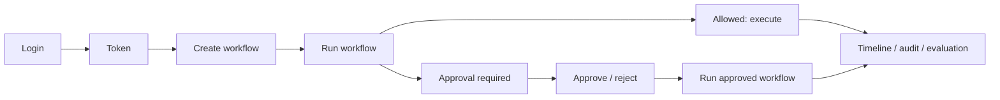

# API Design

The API is FastAPI under `/api/v1`; `/health`, `/ready`, and Prometheus `/metrics`
are root-level system endpoints. Interactive OpenAPI is `/api/docs`. Business routes
use `HTTPBearer` JWT authentication. Permission dependencies protect audit,
observability, employee mutation, and role-specific task functions.

## Error Shape

FastAPI validation and service errors use:

```json
{"detail": "Human-readable error"}
```

Common statuses are 400 invalid state/business input, 401 invalid/missing token, 403
ownership/permission failure, 404 unknown resource, 422 schema validation, 429 rate
limit, and 503 readiness failure.

## Authentication

| Method / route | Authentication | Request | Response |
|---|---|---|---|
| `POST /auth/login` | Public | username, password | identity, roles, access/refresh tokens |
| `POST /auth/refresh` | Public with refresh token body | refresh_token | access token |
| `GET /auth/me` | Bearer | — | current profile |
| `POST /auth/change-password` | Bearer | current/new/confirm | success message |
| `POST /auth/logout` | Public | — | client-side logout message |

Tokens are JWTs; logout does not revoke a token server-side.

## Workflow APIs

| Method / route | Auth | Request | Response / behavior |
|---|---|---|---|
| `POST /workflows/` | Bearer | trigger_type, employee_id?, request_summary, request_data? | new `RECEIVED` workflow |
| `GET /workflows/` | Bearer | state/requester/pagination query | requester-owned page; superuser may query another requester |
| `GET /workflows/{workflow_id}` | Owner/superuser | — | workflow, transitions, evidence count |
| `GET /workflows/{workflow_id}/timeline` | Owner/superuser | — | transitions and evidence summaries |
| `POST /workflows/{id}/run` | Owner/superuser | — | executes/resumes orchestration |
| `POST /workflows/{id}/transition` | Owner/superuser | to_state, reason? | validated manual transition |
| `POST /workflows/{id}/intent` | Owner/superuser | intent | persisted intent |
| `POST /workflows/{id}/pause` | Owner/superuser | reason | pause metadata |
| `POST /workflows/{id}/resume` | Owner/superuser | — | clears pause |
| `POST /workflows/{id}/cancel` | Owner/superuser | reason? | terminal cancellation |
| `POST /workflows/{id}/retry` | Owner/superuser | — | failed → retry scheduled → received |
| `POST /workflows/{id}/clarifications` | Owner/superuser | question, requested_from_id, context? | clarification |
| `POST /workflows/clarifications/{id}/response` | Requested user | response | response and resumed state |

Example create:

```bash
curl -X POST http://localhost:8000/api/v1/workflows/ \
  -H "Authorization: Bearer $ACCESS_TOKEN" \
  -H "Content-Type: application/json" \
  --data-binary @examples/employee_request.json
```

Example run:

```bash
curl -X POST \
  -H "Authorization: Bearer $ACCESS_TOKEN" \
  http://localhost:8000/api/v1/workflows/WF-A1B2C3D4E5F6/run
```

The create endpoint itself does not accept an HTTP idempotency header. Idempotency is
implemented for the downstream action mutation generated by the Action Agent.

## Approval APIs

| Method / route | Auth | Request | Important behavior |
|---|---|---|---|
| `GET /approvals/` | Visible requester/approver/admin | status, pagination | filters results by `can_view` |
| `GET /approvals/{approval_id}` | Visible user | — | full approval and decision history |
| `POST /approvals/` | Workflow owner/superuser | action/risk/roles/evidence | manual approval creation from compliance state |
| `POST /approvals/{id}/approve` | Current role/delegate/superuser | comments? | advances level or resolves approved |
| `POST /approvals/{id}/reject` | Current role/delegate/superuser | comments? | resolves and rejects workflow |
| `POST /approvals/{id}/delegate` | Current decider | delegated_to_id, reason? | active-user delegation |
| `POST /approvals/{id}/cancel` | Requester/superuser | reason? | cancels approval and workflow |
| `POST /approvals/expired/process` | Superuser | — | expires overdue pending approvals |

```bash
curl -X POST \
  -H "Authorization: Bearer $APPROVER_TOKEN" \
  -H "Content-Type: application/json" \
  -d '{"comments":"Evidence and policy references verified"}' \
  http://localhost:8000/api/v1/approvals/APR-A1B2C3D4E5F6/approve
```

The duplicate decision path returns 400 because the approval is no longer pending.
There is no external callback/webhook or feedback endpoint.

## Policy and Incident APIs

| Method / route | Purpose |
|---|---|
| `POST /rag/policies` | Ingest text policy and chunks |
| `POST /rag/policies/upload` | Extract PDF/DOCX/TXT/Markdown upload |
| `GET /rag/policies/search` | Metadata-filtered similarity search |
| `GET /rag/policies/{policy_id}` | Policy metadata/detail |
| `POST /rag/incidents` | Store sanitized incident |
| `GET /rag/incidents/search` | Retrieve similar incident memory |

Policy ingestion currently requires authentication but does not enforce the documented
`manage_policies` permission at route level. This is a known hardening gap.

## Integration APIs

| Method / route | Purpose | Control |
|---|---|---|
| `GET /integrations/health` | Report adapter health | Bearer |
| `GET /integrations/{system}/employees/{id}` | Employee-scoped adapter read | Bearer |
| `POST /integrations/{system}/employees/{id}/dry-run` | Preview allow-listed mutation | Bearer |

There is no public direct-write endpoint. Writes occur through an approved/compliant
workflow action. Adapters are local simulations.

## Task APIs

| Method / route | Purpose |
|---|---|
| `POST /tasks/` | Create manual/event/scheduled task |
| `GET /tasks/` | Priority-ordered task page |
| `GET /tasks/{task_id}` | Task detail |
| `PATCH /tasks/{task_id}/enabled` | Enable/disable |
| `POST /tasks/{task_id}/run` | Manual scan trigger |
| `GET /tasks/{task_id}/runs` | Durable task-run history |

These require superuser, `HR_ADMIN`/`SYSTEM_ADMIN`, or `manage_tasks`.

## Audit, Metrics, and Evaluation

| Method / route | Purpose |
|---|---|
| `GET /audit/` | Filter audit by event, actor, workflow |
| `GET /metrics` | Prometheus text for process-local counters |
| `GET /api/v1/metrics` | Database and runtime dashboard metrics |
| `GET /api/v1/evaluations` | List persisted workflow evaluations |
| `POST /api/v1/evaluations/{workflow_id}` | Upsert one evaluation |
| `POST /api/v1/evaluations/refresh` | Evaluate terminal workflows |

Audit/observability routes require `view_audit` or superuser.

## Lifecycle


