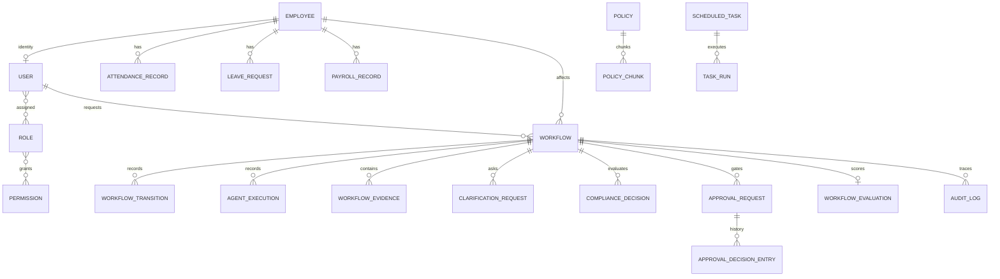

# Data Model

PostgreSQL is the system of record. SQLAlchemy models are registered in
`app.models`; Alembic creates the initial schema and adds workflow evaluations.
Timestamps are stored as naive UTC values by the application.

## Entity Relationship Diagram



`Incident.workflow_id` is a string reference rather than a foreign key.
`IdempotencyRecord` is keyed independently by the action digest.

## Core Entities

### Identity and Employee Data

| Entity | Purpose and lifecycle | Main fields / relationships | Sensitive fields and indexes |
|---|---|---|---|
| `User` | Login identity | username, email, hashed password, active/superuser, employee, roles | Credentials and identity; username/email indexed unique |
| `Role` / `Permission` | Many-to-many RBAC | role names and permission names | Role/permission names indexed unique |
| `Employee` | HR master record | number, name, contact, department, manager, status/type, salary | PII and salary; number/email indexed unique |
| `AttendanceRecord` | Daily attendance | employee, dates, hours, status | Employee/date indexed |
| `LeaveRequest` | Leave transaction | employee, dates, days, status, reason | Employee/start date indexed |
| `PayrollRecord` | Payroll period record | employee, gross/overtime/deductions/net, status | Salary data; employee/period indexed |

### Workflow Storage

`Workflow` is the aggregate root:

- identity: integer `id`, external `workflow_id`
- routing: `trigger_type`, `intent`
- state: `current_state`, `previous_state`, `version`
- scope: requester and optional employee foreign keys
- context: summary and JSON `request_data`
- recovery: retry/max retry, error, pause fields, expiry
- lifecycle: created, updated, completed timestamps

`workflow_id`, `current_state`, and `created_at` are indexed. State changes use
`WHERE workflow_id = ? AND version = ?`; successful updates increment the version.

Related history:

- `WorkflowTransition`: immutable from/to/reason/trigger/time entries.
- `AgentExecution`: ordered input summary, full structured output, duration,
  success/error.
- `WorkflowEvidence`: source, type, JSON data, confidence.
- `ClarificationRequest`: target user, question, deadline, response, timestamps.
- `WorkflowEvaluation`: one persisted score record per workflow.

The JSON request and agent output fields may contain employee data. Production should
classify, minimize, encrypt, and expire these fields.

### Compliance and Approval

- `ComplianceDecisionRecord` stores decision enum, reason, explanation, violations,
  authorization issues, required roles, and evaluation time.
- `ApprovalRequest` stores proposed action, employee, risk/financial impact, policy
  references, ordered roles, current level, expiry, status, resolver, and delegation.
- `ApprovalDecisionEntry` is immutable per approval level and captures role,
  approver, decision, comments, and timestamp.

`approval_id`, workflow foreign key, status, and compliance decision are indexed.
There is no database unique constraint preventing two approvals per workflow; the
service prevents a second **pending** approval.

### Policy, Retrieval, and Memory

- `Policy`: versioned metadata, effective dates, confidentiality, checksum, status.
- `PolicyChunk`: ordered content and a 128-dimensional `PortableVector`.
- `Incident`: sanitized summary, root cause, resolution, outcome, filters, vector.
- `EmbeddingCache`: content hash, original content, JSON vector, model label.

PostgreSQL uses pgvector storage; test/lightweight databases use JSON text. Retrieval
currently fetches filtered candidates and calculates cosine similarity in Python, so
no ANN vector index is used.

### Scheduling

`TaskPriority` values are `CRITICAL`, `HIGH`, `MEDIUM`, and `LOW`. Repository ordering
maps them to 0–3, then orders by creation/due time.

`ScheduledTask` stores:

- enabled flag and trigger type (`SCHEDULE`, `MANUAL`, or `EVENT`)
- cron and next/last run time
- target scope (`ALL_EMPLOYEES`, `DEPARTMENT`, `COUNTRY`, `EMPLOYEE`, or none)
- workflow intent and JSON payload
- priority, owner identity/name, timeout, and retry configuration

`TaskRun` stores status, trigger actor, duration, created workflow results, error,
retry count, and next retry time. Failed runs use fixed or exponential delay.

### Audit and Idempotency

`AuditLog` records event/actor/workflow/entity/action/decision, metadata, timestamp,
and entity-local hash links. Indexes support event type and timestamp queries.

`IdempotencyRecord` has a unique idempotency key plus HTTP-like request and saved
response fields. Adapter execution checks this record before mutation.

## Lifecycle Summary

```text
request → Workflow
        → transitions + executions + evidence + compliance
        → optional clarification or approval
        → adapter idempotency record
        → completed incident memory
        → optional evaluation
```

## Recommended Production Extensions

These are not current tables:

- tenant/organization and data-residency partition keys
- workflow job lease/outbox/dead-letter records
- notification delivery and retry records
- vendor webhook event/deduplication records
- encrypted sensitive-field envelope metadata
- audit export checkpoints and retention policies
- LLM request metadata/token usage without storing raw sensitive prompts
