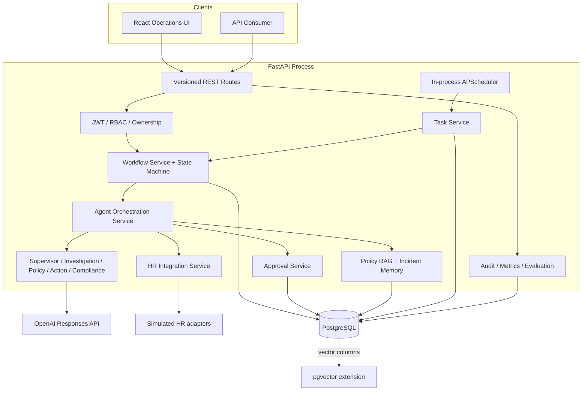
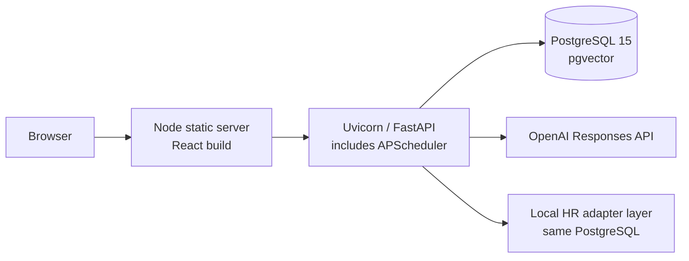

# High-Level Design

## System Context

DARWINBOXAI serves employees who submit requests, HR operators who investigate and
manage tasks, managers/specialists who approve sensitive actions, administrators who
manage operational data, and auditors who inspect events. OpenAI provides reasoning.
Policy documents are ingested through the API. “External” HR systems are currently
local SQLAlchemy adapters over seeded HR data. Notification delivery is not
implemented; approval-notification intent is recorded as an audit event.

## Architecture

### Architectural Boundaries

- **Agentic reasoning:** five agents call OpenAI Responses API and return strict JSON.
- **Deterministic platform:** routes, authentication, state machine, repositories,
  compliance invariants, approval, scheduler, adapters, idempotency, and audit.
- **Data:** PostgreSQL is authoritative. pgvector is selected by dialect for policy
  chunk and incident vectors; SQLite stores JSON text in tests.
- **Integrations:** OpenAI is real. HR adapters are simulated local integrations.
  Redis, queue, cache server, notification provider, and production IdP are absent.

## Component Details

| Component | Responsibility | Inputs / outputs | Dependencies | Failure and scaling |
|---|---|---|---|---|
| FastAPI routes | Validate HTTP contracts and enforce dependencies | Pydantic requests/responses | Services, JWT, DB session | Maps service errors to 4xx; horizontally scalable if scheduler is separated |
| Workflow service | Create, transition, pause, resume, cancel, retry, clarify | Workflow ID/state | Repository, state machine, audit | Invalid/terminal/paused transitions fail; optimistic version check |
| Agent orchestrator | Execute and persist the five-stage graph | Persisted workflow | Agents, RAG, integrations, approval | Agent/adapter errors mark `FAILED`; synchronous LLM latency |
| Agents | Produce structured intent, findings, citations, action, decision | Normalized context | OpenAI Responses API | Timeout/retry then fail closed; more replicas increase LLM concurrency |
| OpenAI client | Bearer-authenticated structured-output request | Prompt, schema, context | HTTPS API | Retries 408/409/429/5xx; rejects malformed/refused/incomplete output |
| RAG | Ingest/chunk policies and retrieve relevant chunks | Text and metadata | PostgreSQL/pgvector | Local scoring loads candidate chunks; production ANN index recommended |
| Incident memory | Store/retrieve sanitized resolved cases | Workflow result | PostgreSQL/pgvector | Regex redaction is partial; stronger PII detection required |
| Compliance | Route allowed, approval, denied, escalated actions | Risk, policy, authorization flags | Agent output + deterministic constraints | Fail closed on invalid decision |
| Approval service | Durable, role-based multi-level consent | Action and required roles | DB, workflow service | Duplicate, expired, unauthorized decisions rejected |
| HR integration service | Read/freshness/dry-run/write/idempotency | Employee/action | Adapter registry, DB | Local simulations; vendor timeouts/webhooks not implemented |
| Task service | Schedule priority scans and durable retries | Cron, scope, payload | APScheduler, workflows | Retry with backoff; in-process scheduler is not multi-replica safe |
| Audit/observability | Reconstruct events and expose metrics | Service events | DB and process memory | Metrics/rate limits are per process; hashes are not externally anchored |

## Request Lifecycle

A payroll request is inserted as `RECEIVED`. The orchestrator authenticates and
authorizes the persisted workflow, invokes the supervisor, retrieves similar incidents
and employee/payroll records, checks data freshness, investigates, retrieves policies,
proposes an idempotent correction, and records compliance. An allowed low-risk action
executes immediately. A high-risk correction persists an approval and pause. After an
authorized approval, the workflow is resumed from stored agent outputs and the
adapter performs dry-run, allow-listed write, verification, audit, and memory storage.

## Deployment View

Docker Compose starts three containers: frontend, backend, and PostgreSQL. There is no
queue or separate worker container. The backend runs seeding before Uvicorn. For
production, seeding should be a one-time job and scheduler ownership should move to a
singleton worker or leased task queue.

## Scalability

- **API:** stateless JWT/API processing can scale horizontally, but the current
  in-process scheduler and process-local rate limiter/metrics need extraction.
- **Workers:** current agent runs are synchronous. A durable queue should carry
  workflow-step jobs with workflow/version leases.
- **Database:** workflow versioning detects competing updates, but approval and task
  selection would benefit from transactional row locks in multi-worker deployment.
- **Tasks:** priority ordering is in SQL. Distributed execution requires claim/lease
  columns and `SKIP LOCKED`.
- **RAG:** current application-side cosine scoring is acceptable for interview data;
  production should use pgvector distance operators and ANN indexes.
- **Caching:** embedding rows are cached in PostgreSQL. No Redis cache exists.

## Reliability

### Implemented

- Explicit transition validation and persisted transition history
- Optimistic workflow version updates
- OpenAI timeout and bounded retry for transient HTTP responses
- Task retry scheduling with fixed/exponential backoff
- Adapter dry-run, allow lists, and persisted idempotency response
- Approval status/expiry/role checks and duplicate-decision rejection
- State recovery from persisted agent executions after approval or clarification

### Production Recommendations

- Durable broker, worker leases, and dead-letter queue
- Transactional outbox for notifications and vendor mutations
- Signed webhook/callback idempotency
- Circuit breakers and vendor-specific timeout/reconciliation policies
- Database failover, backups, and point-in-time recovery
- External audit anchoring and immutable export
- Distributed traces, metrics, rate limits, and health probes

Partial failure today generally moves a running workflow to `FAILED`; database
unavailability causes the request or scheduler iteration to fail. There is no
dead-letter handler. Duplicate adapter execution is prevented only when the generated
idempotency record was committed successfully.
