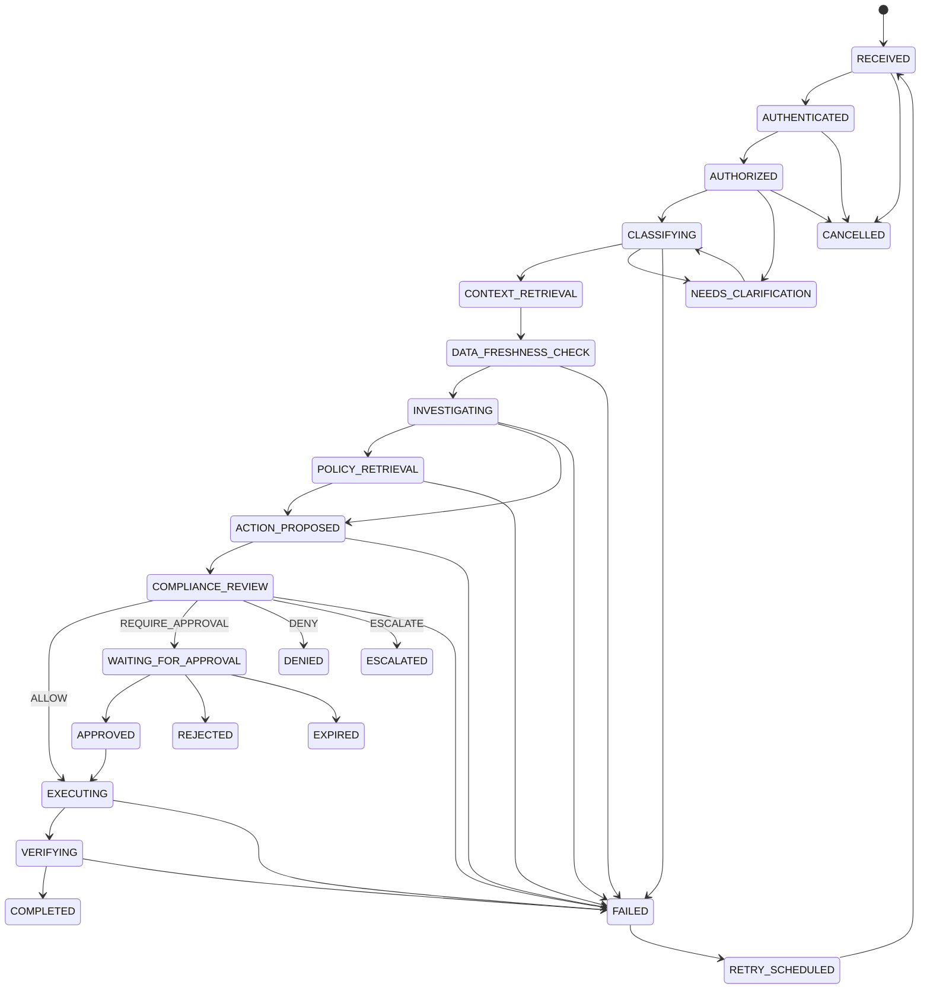

# Workflow and Human Approval

## Workflow State Machine

The transition map below mirrors `WorkflowStateMachine.VALID_TRANSITIONS`. Pause is
stored as `paused_at`/`paused_reason`, not as a separate enum state.



Most non-terminal states also allow `CANCELLED`; those repeated edges are summarized
above. `FAILED` is intentionally retryable and therefore is not considered terminal
by the state-machine helper.

## High-Risk Payroll Sequence

```mermaid
sequenceDiagram
    actor User
    actor Approver
    participant API as FastAPI
    participant WF as Workflow Service
    participant DB as PostgreSQL
    participant O as Orchestrator
    participant A as LLM Agents
    participant R as RAG / Memory
    participant H as HR Adapter
    participant C as Compliance
    participant P as Approval Service
    participant Audit as Audit Log

    User->>API: POST /workflows/
    API->>WF: create_workflow
    WF->>DB: Workflow(RECEIVED)
    WF->>Audit: workflow_created
    User->>API: POST /workflows/{id}/run
    API->>O: run persisted workflow
    O->>DB: AUTHENTICATED → AUTHORIZED → CLASSIFYING
    O->>A: Supervisor structured classification
    A-->>O: PAYROLL_ANOMALY
    O->>R: retrieve similar incidents
    O->>H: read HRIS + payroll context
    O->>DB: DATA_FRESHNESS_CHECK
    O->>A: Investigation
    A-->>O: evidence and discrepancy
    O->>R: retrieve policy chunks
    O->>A: Policy and Action agents
    A-->>O: citations and idempotent proposal
    O->>A: Compliance agent
    A-->>C: REQUIRE_APPROVAL
    C->>DB: compliance decision
    C->>P: create role-based approval
    P->>DB: WAITING_FOR_APPROVAL + paused_at
    P->>Audit: approval_requested / notification_queued
    Approver->>API: POST /approvals/{id}/approve
    API->>P: authorize role and record decision
    P->>DB: APPROVED + clear pause
    P->>Audit: approval_decision
    User->>API: POST /workflows/{id}/run
    API->>O: resume from persisted agent outputs
    O->>H: dry-run then allow-listed write
    H->>DB: mutation + idempotency record
    O->>DB: EXECUTING → VERIFYING → COMPLETED
    O->>R: store sanitized incident memory
    O->>Audit: transitions and action event
    Note over P,Audit: Notification delivery is not implemented; only queue intent is audited.
```

## Persistence and Resume

The workflow row stores current/previous state, optimistic `version`, request JSON,
retry counters, errors, pause metadata, and lifecycle timestamps. Transition,
execution, evidence, clarification, compliance, approval, and audit rows provide the
reconstruction trail.

The approval pause occurs after all five agent outputs are persisted. Approval clears
the pause and transitions to `APPROVED`. The next run loads the saved agent execution
outputs and proceeds directly to adapter execution. Clarification uses a similar
pattern: it persists a question and pause; an authorized response clears the pause,
moves back to `CLASSIFYING`, and execution continues without rerunning the supervisor.

## Human Approval

- Required roles come from the compliance result; default is `HR_ADMIN`.
- Approval may contain multiple ordered roles. Each approval creates an immutable
  `ApprovalDecisionEntry`; only the final level resolves the request.
- Superusers, the current required role, or an active delegate can decide.
- Delegation is persisted and cannot target the delegator.
- Expiry defaults to 48 hours and moves both approval and workflow to `EXPIRED`.
- Rejection moves the workflow to terminal `REJECTED`.
- A second decision is rejected because status is no longer `PENDING`.
- An unauthorized user receives 403 through the route/service mapping.
- No webhook callback endpoint exists; decisions are authenticated REST calls.

## Failure Scenarios

| Scenario | Current behavior | Production extension |
|---|---|---|
| Policy retrieval returns no match | Policy agent returns ungrounded/no-match; workflow can still reach compliance | Require minimum policy evidence for selected actions |
| Policy retrieval throws | Orchestrator catches runtime/value errors and marks `FAILED` | Queue retry and retrieval circuit breaker |
| HR adapter stale/read failure | Freshness check attempts refresh; unresolved stale context marks `FAILED` | Vendor retry budget and reconciliation |
| Approval timeout | Expiry processor marks approval/workflow `EXPIRED` | Scheduled SLA escalation and notification |
| Duplicate approval | Non-pending status rejects it | Signed callback key if webhooks are added |
| Action execution failure | Workflow moves to `FAILED`; task may schedule retry | Compensating transaction/outbox |
| Database failure | Transaction/request fails; no global recovery handler | HA database, retryable transaction wrapper |
| Invalid/refused LLM output | Strict parsing raises; orchestrator marks `FAILED` | Persist response metadata and quarantined review |
| Duplicate action call | Idempotency record returns saved response | Vendor-side idempotency and reconciliation |

## Auditability

Workflow transitions, agent execution metadata, evidence, compliance results,
approval decisions, adapter actions, scheduled task runs, and evaluations are
persisted. Audit records contain previous/current hashes per entity, but the current
hash is derived from the supplied state object (often empty), and the chain is not
externally anchored. It is tamper-evident intent, not a production immutable ledger.
